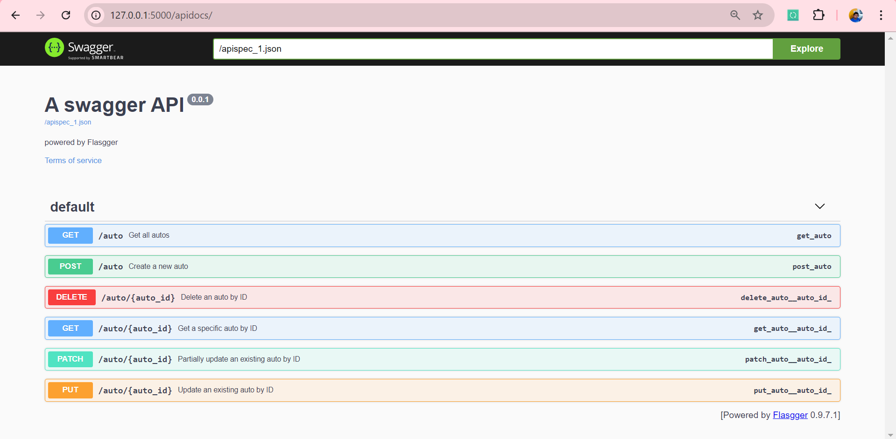

# Auto Parking API

## Overview
The **Auto Parking API** is a RESTful API that allows users to manage a collection of parking spots for autos. Users can create, retrieve, update, and delete information related to parking spots, including their names and prices.

## Features
- Retrieve all parking spots
- Retrieve a specific parking spot by ID
- Create a new parking spot
- Update an existing parking spot
- Partially update an existing parking spot
- Delete a parking spot by ID

## Technologies Used
- **Flask**: Web framework for building the API.
- **SQLAlchemy**: ORM for database interactions.
- **SQLite**: Lightweight database for storing parking spot data.
- **Flasgger**: Swagger UI integration for API documentation.

## Installation

1. Clone the repository:

   ```bash
   git clone https://github.com/jeetendra29gupta/Auto_Parking_API
   cd Auto_Parking_API
   ```

2. Create a virtual environment:

   ```bash
   python -m venv venv
   source venv/bin/activate  # On Windows use `venv\Scripts\activate`
   ```

3. Install the required packages:

   ```bash
   pip install Flask SQLAlchemy flasgger
   ```

4. Run the application:

   ```bash
   python app.py
   ```

5. Access the API: Open your web browser and go to [http://127.0.0.1:5000/apidocs/](http://127.0.0.1:5000/apidocs/) for the API documentation.

## API Endpoints

### 1. Get All Autos
- **Endpoint**: `GET /auto`
- **Response**:
  - `200 OK`: Returns a list of all autos.
  - `500 Internal Server Error`: An error occurred while retrieving autos.

### 2. Get Auto by ID
- **Endpoint**: `GET /auto/<int:auto_id>`
- **Response**:
  - `200 OK`: Returns the details of the specified auto.
  - `404 Not Found`: Auto not found.
  - `500 Internal Server Error`: An error occurred while retrieving the auto.

### 3. Create New Auto
- **Endpoint**: `POST /auto`
- **Request Body**:

   ```json
   {
     "parking_name": "Example Parking",
     "parking_price": 10.0
   }
   ```

- **Response**:
  - `201 Created`: Auto created successfully.
  - `400 Bad Request`: Invalid input.
  - `500 Internal Server Error`: An error occurred while creating the auto.

### 4. Update Auto by ID
- **Endpoint**: `PUT /auto/<int:auto_id>`
- **Request Body**:

   ```json
   {
     "parking_name": "Updated Parking",
     "parking_price": 15.0
   }
   ```

- **Response**:
  - `200 OK`: Auto updated successfully.
  - `404 Not Found`: Auto not found.
  - `500 Internal Server Error`: An error occurred while updating the auto.

### 5. Partially Update Auto by ID
- **Endpoint**: `PATCH /auto/<int:auto_id>`
- **Request Body**:

   ```json
   {
     "parking_price": 12.0
   }
   ```

- **Response**:
  - `200 OK`: Auto partially updated successfully.
  - `404 Not Found`: Auto not found.
  - `500 Internal Server Error`: An error occurred while partially updating the auto.

### 6. Delete Auto by ID
- **Endpoint**: `DELETE /auto/<int:auto_id>`
- **Response**:
  - `204 No Content`: Auto deleted successfully.
  - `404 Not Found`: Auto not found.
  - `500 Internal Server Error`: An error occurred while deleting the auto.

## Logging
The application logs various events such as errors and successful operations. The logs are configured to display messages at the INFO level and above, providing insights into the application's execution.

## Database
The application uses SQLite to store autos. A database file named `autos.db` will be created in the project directory upon running the application for the first time.

## License
This project is licensed under Free open source.

## API Documentation Screenshot
Here is a screenshot of the API documentation:

